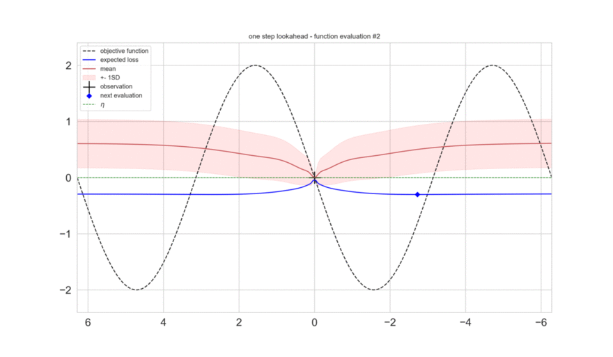

# Gaussian Processes for Global Optimization

An implementation of Osborne et al. [_"Gaussian Processes for Global Optimization"_](http://www.robots.ox.ac.uk/~mosb/public/pdf/115/Osborne%20et%20al.%20-%202009%20-%20Gaussian%20processes%20for%20global%20optimization.pdf) by Lukas Radke, Aiko Pipo and Oliver Atanaszov.

  

This paper aims at optimizing black-box objective functions which are _expensive_ to evaluate by using Gaussian Processes and Bayesian Inference.

Our implementation supports:

* periodic/non-periodic kernels
* optimization of functions with noisy observations
* hyperparameter sampling and marginalization (using MCMC)
  
See "demo.ipynb" and "demo-experiments.ipynb" for example usage and our report.